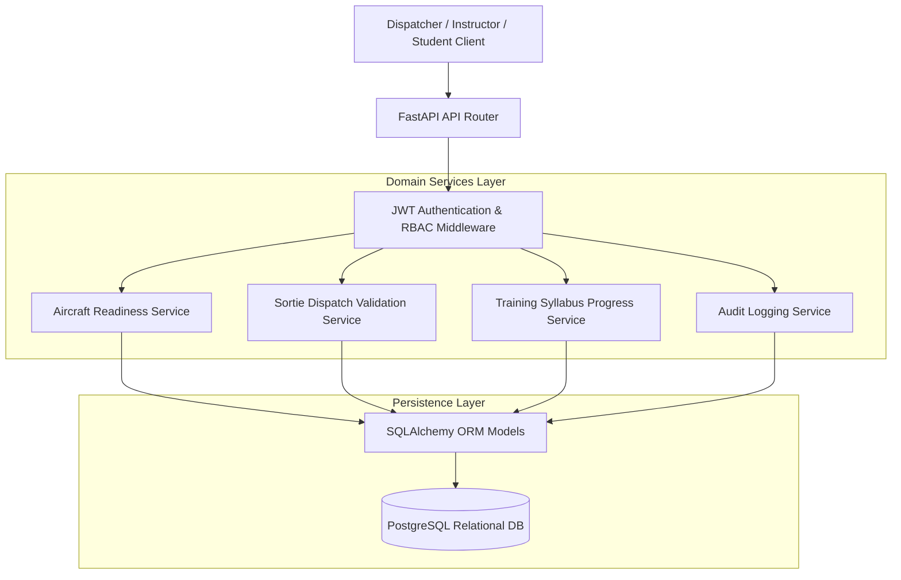

<div align="center">

# Skynet Flight Operations API

### Aviation Academy Flight School Operations Backend & RBAC Dispatch Engine

[](https://www.python.org/)
[](https://fastapi.tiangolo.com/)
[](https://www.postgresql.org/)
[](docker-compose.yml)
[](tests/)
[](LICENSE)

---

> **Aviation Operations Compliance**: A layered RESTful backend service for **AIRMAN's Flight School & Aviation Academy Operations SaaS**. Enforces strict civil aviation regulations, multi-base aircraft airworthiness tracking, student syllabus sortie progression, and auditable dispatcher authorization workflows.

</div>

---

## 1. System Architecture & Domain Model

The service follows a domain-driven, layered architecture strictly separating API route controllers, business validation services, database ORM models, and Pydantic schemas:



---

## 2. Core Capabilities & Aviation Workflows

- **Role-Based Access Control (RBAC)**: Distinct permission scopes for `Admin`, `Dispatcher`, `CFI` (Chief Flight Instructor), `Instructor`, and `Student`.
- **Airworthiness Lifecycle Management**: Tracks aircraft readiness across states (`AIRWORTHY`, `MAINTENANCE_HOLD`, `GROUNDED`) with mandatory tach/Hobbs hour limits.
- **Flight Sortie Dispatch**: Validates instructor endorsements, weather minimums, student syllabus eligibility, and aircraft availability before issuing sortie clearance.
- **Training Progression Logs**: Automates dual and solo flight-hour logging, syllabus exercise completion, and checkride qualification checklists.
- **Auditable Event Logs**: Immutable tracking of sortie cancellations, maintenance write-ups, and flight-hour signoffs.

---

## 3. Technology Stack

- **Framework**: Python 3.11, FastAPI
- **Database & ORM**: PostgreSQL 15, SQLAlchemy (async-ready query structure)
- **Data Validation**: Pydantic v2
- **Authentication**: JWT tokens (OAuth2 password bearer with Passlib/Bcrypt)
- **Containerization**: Docker & Docker Compose
- **Testing**: Pytest with test client and isolated SQLite/Postgres test fixtures

---

## 4. Project Structure

```
skynet-flight-ops-api/
├── app/
│   ├── api/v1/                 # Endpoints (auth, aircraft, sorties, training)
│   ├── core/                   # Security, config (pydantic-settings), JWT
│   ├── db/                     # SQLAlchemy session & seed script
│   │   ├── base.py
│   │   ├── session.py
│   │   └── seed.py             # Pre-populates 2 bases, 3 aircraft, 6 roles
│   ├── models/                 # Relational database models
│   ├── schemas/                # Pydantic v2 schemas
│   ├── services/               # Aviation validation logic
│   └── main.py                 # FastAPI application factory
├── docs/                       # Architectural notes and API specifications
├── tests/                      # Automated test suite
│   ├── conftest.py
│   ├── test_aircraft.py
│   ├── test_audit_logs.py
│   ├── test_rbac.py
│   ├── test_sorties.py
│   └── test_training_progress.py
├── Dockerfile
├── docker-compose.yml
├── requirements.txt
└── README.md
```

---

## 5. Quickstart & Installation

### Option A: Run via Docker Compose (Recommended)

Spins up both the FastAPI application and the PostgreSQL database in isolated containers:

```bash
git clone https://github.com/Vikram30069/skynet-flight-ops-api.git
cd skynet-flight-ops-api
docker-compose up --build -d
```

Seed initial aviation bases, aircraft, and test users:
```bash
docker-compose exec api python -m app.db.seed
```

Access the interactive OpenAPI Swagger documentation at:  
👉 `http://localhost:8000/docs`

### Option B: Local Python Setup

1. **Virtual environment setup:**
   ```bash
   python -m venv venv
   source venv/bin/activate  # On Windows: venv\Scripts\activate
   pip install -r requirements.txt
   ```

2. **Configure environment:**
   ```bash
   cp .env.example .env
   ```

3. **Run database seed script:**
   ```bash
   python -m app.db.seed
   ```

4. **Start the API:**
   ```bash
   uvicorn app.main:app --reload --port 8000
   ```

---

## 6. Automated Testing

Run the full pytest suite covering RBAC, sortie scheduling, and aircraft status transitions:

```bash
pytest tests/ -v
```

**Key Tests Covered:**
- `test_rbac.py`: Asserts that Students cannot dispatch aircraft or modify maintenance records.
- `test_aircraft.py`: Enforces state transitions preventing sortie dispatch on grounded aircraft.
- `test_sorties.py`: Validates sortie completion workflows and automatic flight-hour ledger updates.

---

## 7. License

This project is licensed under the MIT License — see the [LICENSE](LICENSE) file for details.
